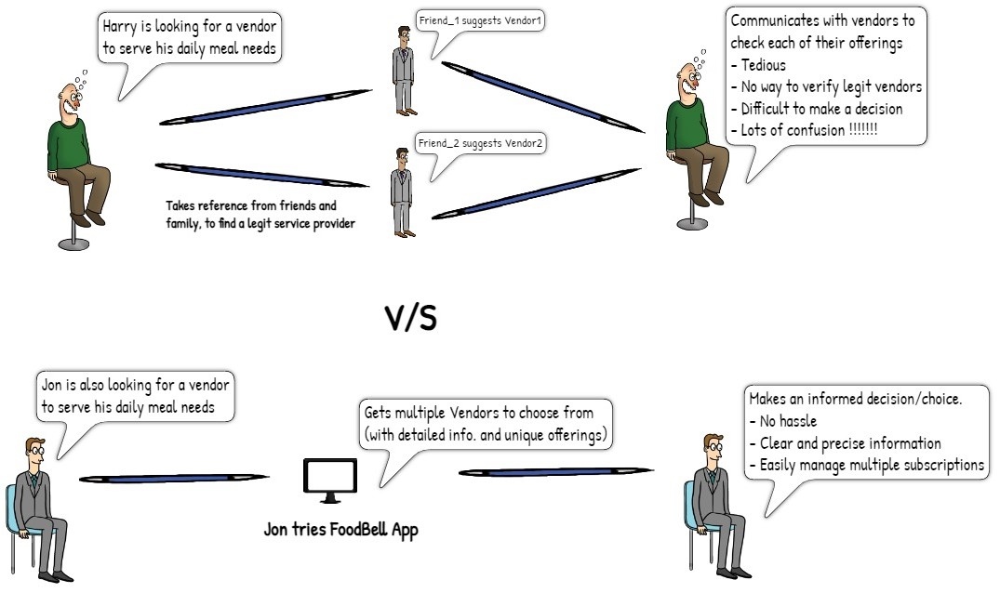
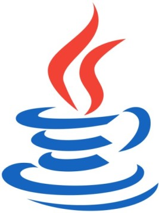
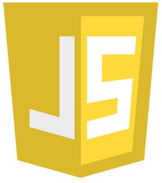
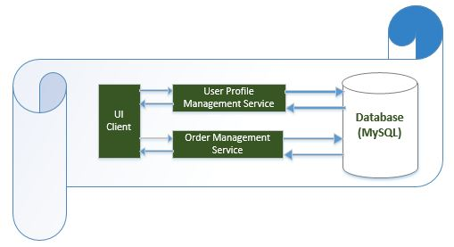
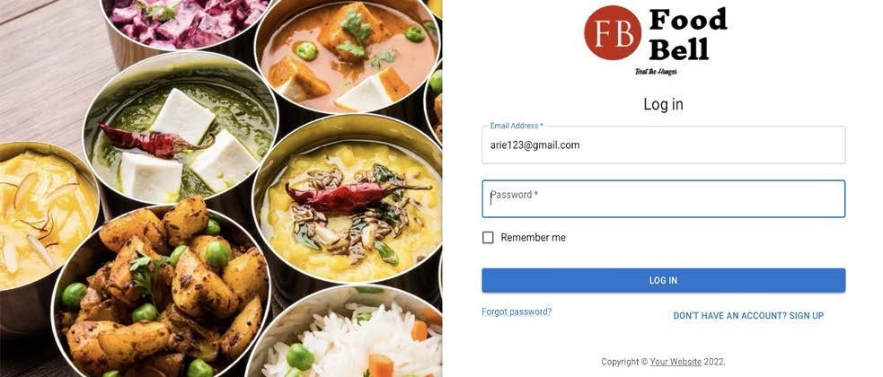

<!-- Reference:
https://github.com/othneildrew/Best-README-Template -->

<!-- PROJECT LOGO -->
 

  <h1><i>Travel Genius</i></h1>

  
  
  .

  

    An end-to-end solution to decode your everyday hunger demands !
  

 
 

<!-- TABLE OF CONTENTS -->

  
Table of Contents

  <ol>
    <li><a href="#about-the-project">About The Project</a></li>
    <li><a href="#built-with">Built With</a></li>
    <li><a href="#getting-started">Getting Started</a></li>
    <li><a href="#overview">Overview</a></li>
    <li><a href="#license-or-author">License or Author</a></li>
    <li><a href="#contact">Contact</a></li>
    <li><a href="#acknowledgments">Acknowledgments</a></li>
  </ol>

 

<!-- ABOUT THE PROJECT -->
## About The Project
  ‘FoodBell’ is an asynchronous solution for facilitating subscription-based (recurring) meal services – using a dedicated application, secure micro-service architecture and CI/CD approach.
  
  ##### Objectives
  * The Objective is to create a unified solution ‘Food Bell’ -a web application that provides an interface for facilitating subscription-based meal services by connecting customers to the right vendors.
  * This system will save major efforts involved in exploring meal and vendor options for the customers.
  * With the help of this system, vendors would have a hassle-free experience in managing and tracking all their orders.
  * The solution aims at fulfilling the demand and supply gap in the food industry.
  
  

  
  
(<a href="#readme-top">back to top</a>)

## Built With
  &nbsp; &nbsp; &nbsp;  &nbsp; &nbsp; &nbsp; &nbsp; &nbsp; &nbsp; &nbsp;  &nbsp; &nbsp; &nbsp; &nbsp; &nbsp; &nbsp;  &nbsp; &nbsp; &nbsp; &nbsp; &nbsp; &nbsp;  &nbsp; &nbsp; &nbsp; &nbsp; &nbsp; &nbsp; &nbsp;  &nbsp; &nbsp; &nbsp; &nbsp; &nbsp; &nbsp; &nbsp; 

  &nbsp; &nbsp; &nbsp; &nbsp; <b><i> Java </i></b> &nbsp; &nbsp; &nbsp; &nbsp; &nbsp; &nbsp; &nbsp; &nbsp; &nbsp; &nbsp; <b><i> Spring Boot </i></b> &nbsp; &nbsp; &nbsp; &nbsp; &nbsp; &nbsp; &nbsp; &nbsp; <b><i> MySQL </i></b> &nbsp; &nbsp; &nbsp; &nbsp; &nbsp; &nbsp; &nbsp; &nbsp; &nbsp; &nbsp; &nbsp; &nbsp; <b><i> React </i></b> &nbsp; &nbsp; &nbsp; &nbsp; &nbsp; &nbsp; &nbsp; &nbsp; <b><i> JavaScript </i></b> &nbsp; &nbsp; &nbsp; &nbsp; &nbsp; &nbsp; <b><i> Selenium </i></b>

  
(<a href="#readme-top">back to top</a>)

<!-- GETTING STARTED -->
## Getting Started
  #### Prerequisites
  * Java, Spring Boot Framework, MySQL Workbench, Selenium Extension
  * Apache Tomcat Server
  * Node.js
  * IDE - Eclipse or IntelliJ (Preferred)
  * Minimum - 4GB RAM, Intel i5 CPU (or Equivalent)

  #### Setup & Use
  1. ##### Set-up Microservices and and UIClient
     1. Get <b>'FoodBellApp'</b> from the parent directory.
     2. Import <b>'FoodBellApp'</b> to IDE.

  2. ##### Set-up Database
     1. Get <b>'Important Files/SQL_PreTest_Commands.txt'</b>.
     2. Set-up a new Database in SQL Workbench.
     3. Start the database.
     4. Copy the DB credentials.

  3. ##### Connect Database and Microservices
     1. Update the following files (corresponding to each microservice) with newly set-up database credentials:
        * FoodBellApp/OrderMgmntService/src/main/resources/application.properties
        * FoodBellApp/UserMgmntService/src/main/resources/application.properties
     2. Run commands from <b>'Important Files/SQL_PreTest_Commands.txt'</b> in SQL workbench.
     
  

  4. ##### Run and use the application
     1. Start the following microservices (in squence):
        * UserMgmntService
        * OrderMgmntService
     2. Start the Application Gateway & End-application (UIClient)
     3. Open the respective port in a web-browser.
     4. You are all set.

  
(<a href="#readme-top">back to top</a>)

<!-- Overview -->
## Overview
  #### Technical Brief:
  * Created an optimal ‘vendor-consumer’ model & leveraged it to design the user application with targeted functionalities.
  * Architected a secure Micro-service model, with a Gateway facilitating 3 different services (consumer, vendor, auth).
  * Allowed real time communication between vendor & consumer platforms; used Cron jobs to facilitate automated changes.  .

  <spacer type="vertical" height="4" width="2"></spacer>
  
  #### Detailed Architecture:
  

  <spacer type="vertical" height="4" width="2"></spacer>

  #### Sample Run:
  

  .
  
(<a href="#readme-top">back to top</a>)

<!-- LICENSE -->
## License or Author
  * Uditya Laad
  * Niravkumar Talaviya

  
(<a href="#readme-top">back to top</a>)

<!-- CONTACT -->
## Contact
  <b>Uditya Laad</b> &nbsp; [@linkedin.com/in/uditya-laad-222680148](https://www.linkedin.com/in/uditya-laad-222680148/)
  
  &nbsp; &nbsp; &nbsp; &nbsp; &nbsp; &nbsp; &nbsp; &nbsp; &nbsp; &nbsp; &nbsp; [@github.com/udityalaad](https://github.com/udityalaad)
  
  &nbsp; &nbsp; &nbsp; &nbsp; &nbsp; &nbsp; &nbsp; &nbsp; &nbsp; &nbsp; &nbsp; udityalaad123@gmail.com

  <b>Project Link</b> &nbsp; [https://github.com/udityalaad/FoodBell](https://github.com/udityalaad/FoodBell)

  
(<a href="#readme-top">back to top</a>)

<!-- ACKNOWLEDGMENTS -->
## Acknowledgments
  * Many thanks to Prof. Paul Ward (ECE 656, University of Waterloo) for his guidance and assistance throughout the project.
  * [github.com/othneildrew/Best-README-Template/](https://github.com/othneildrew/Best-README-Template)
  * [Traditional Food Around The World: 50 Famous Dishes You Have To Try](https://www.travlinmad.com/blog/traditional-food-around-the-world)

  
(<a href="#readme-top">back to top</a>)

