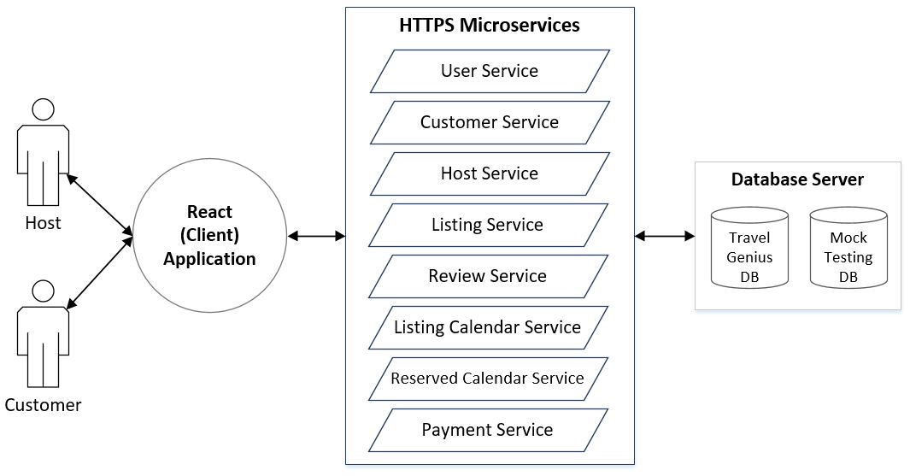

<!-- Reference:
https://github.com/othneildrew/Best-README-Template -->

<!-- PROJECT LOGO -->
 

  <h1><i>Travel Genius</i></h1>

  
  
  .

  

    A novel approach to System Design for Machine Learning !
  

 
 

<!-- TABLE OF CONTENTS -->

  
Table of Contents

  <ol>
    <li><a href="#about-the-project">About The Project</a></li>
    <li><a href="#built-with">Built With</a></li>
    <li><a href="#getting-started">Getting Started</a></li>
    <li><a href="#overview">Overview</a></li>
    <li><a href="#license-or-author">License or Author</a></li>
    <li><a href="#contact">Contact</a></li>
    <li><a href="#acknowledgments">Acknowledgments</a></li>
  </ol>

 

<!-- ABOUT THE PROJECT -->
## About The Project
  ‘Travel Genius’ is a short-term accommodation portal to demonstrate an innovative approach to System & DB Design, Query Optimization, Scalability, Data Mining and utilization of Machine Learning & LLMs in modern applications.

## Built With
  &nbsp; &nbsp; &nbsp;  &nbsp; &nbsp; &nbsp; &nbsp; &nbsp; &nbsp;  &nbsp; &nbsp; &nbsp; &nbsp; &nbsp; &nbsp;  &nbsp; &nbsp; &nbsp; &nbsp; &nbsp; &nbsp;  &nbsp; &nbsp; &nbsp; &nbsp; &nbsp; &nbsp;  &nbsp; &nbsp; &nbsp; &nbsp; &nbsp; &nbsp; 

  &nbsp; &nbsp; &nbsp; &nbsp; &nbsp; <b><i> MySQL </i></b> &nbsp; &nbsp; &nbsp; &nbsp; &nbsp; &nbsp; &nbsp; &nbsp; &nbsp; &nbsp; <b><i> NodeJS </i></b> &nbsp; &nbsp; &nbsp; &nbsp; &nbsp; &nbsp; &nbsp; &nbsp; <b><i> ExpressJS </i></b> &nbsp; &nbsp; &nbsp; &nbsp; &nbsp; &nbsp; &nbsp; <b><i> React </i></b> &nbsp; &nbsp; &nbsp; &nbsp; &nbsp; &nbsp; &nbsp; &nbsp; &nbsp; <b><i> Python </i></b> &nbsp; &nbsp; &nbsp; &nbsp; &nbsp; <b><i> TensorFlow </i></b>

  
(<a href="#readme-top">back to top</a>)

<!-- GETTING STARTED -->
## Getting Started
  #### Prerequisites
  * Python, MySQL
  * NodeJS
  * Dependencies (Configured in each application)
  * IDE - VS Code (Preferred)
  * Minimum - 4GB RAM, Intel i5 CPU (or Equivalent)

  #### Setup & Use
  1. ##### Database
     * Follow instructions provided in:  [backend_travelgenius](https://github.com/udityalaad/TravelGenius/blob/main/backend_travelgenius/Readme.md)
  

  2. ##### Client Application
     * Set-up & Run Microservices as per instructions provided in:  [backend_travelgenius](https://github.com/udityalaad/TravelGenius/blob/main/backend_travelgenius/Readme.md)
    
     * Set-up & Run Front-end application as per instructions provided in:  [ece656_frontend](https://github.com/udityalaad/TravelGenius/blob/main/ece656_frontend/README.md)

  3. ##### Data Analysis
     1. Open Jupyter Notebook: [__ datamining_/DataMining.ipynb](https://github.com/udityalaad/TravelGenius/blob/main/__datamining_/DataMining.ipynb)
     2. Uncomment Code in 'Code-Block-1'
     3. Fill-in **'username'** & **'password'** of MySQL DB (Setup in Step-1) in 'Code-Block-1'
     4. Setup Python Environment
     5. Run the Jupyter Notebook
     
  
(<a href="#readme-top">back to top</a>)

<!-- Overview -->
## Abstract
[

](https://youtu.be/neEtsIxrcA8)

  #### Client Application:
  Current decade has taken the concept of globalization to a larger scale, which has also lead to a boom of tourism industry in multiple countries around the world. And with technology at the face of enabling smooth travel planning and arrangement, the demand for centralized systems to facilitate reservation and management of temporary stay accommodations has grown exponentially in the last 2 decades. Customers (specially travellers) prefer an all-in-one interface where they can find ideal accommodations, book and manage reservations, make payments and so on. As for hosts, they prefer an interface to list and manage their properties. Airbnb, of late, has been a major player in the hospitality industry and has made available a wealth of data from their system that spans many regions. This project makes use of these large Airbnb datasets, translates them to a non-trivial relational form and provides a centralized client application to facilitate stay reservations and listings management for customers and hosts respectively.

  <spacer type="vertical" height="4" width="2"></spacer>
  

  <spacer type="vertical" height="4" width="2"></spacer>

  * **Sample Run:**
  

  #### Data Analysis:
  * **Domain Appropriate Question:** What is the likelihood of success for a listing with respect to its features ?
  
  <spacer type="vertical" height="4" width="2"></spacer>

  * **Dependent Attribute:** How do we measure success ?
We have 2 Relations - **‘ListingCalendar’** (Availabilities for a listing on multiple unique days, which may also be reserved) & **‘ReservedCalendar’** (ListingCalendar that are reserved by customers). Hence we define:

        SuccessRate(listingId) = |ReservedCalendar(listingId)| / |ListingCalendar(listingId)|

    **'Success-Rate'** is not directly available as a field in the database. Hence, we trigger an SQL query to compute this field and associate it with the corresponding Listing features via the Jupyter Notebook.

  <spacer type="vertical" height="4" width="2"></spacer>

  * **Independent Attibutes:** Subset of features associated with listings
    (For Selection Criteria, please refer: [Project_Report.pdf](https://github.com/udityalaad/TravelGenius/blob/main/Project_Report.pdf))
  
  <spacer type="vertical" height="4" width="2"></spacer>

  * **Sample Run:**
  

  

  .
  
(<a href="#readme-top">back to top</a>)

<!-- LICENSE -->
## License or Author
  * Uditya Laad
  * Niravkumar Talaviya

  
(<a href="#readme-top">back to top</a>)

<!-- CONTACT -->
## Contact
  <b>Uditya Laad</b> &nbsp; [@linkedin.com/in/uditya-laad-222680148](https://www.linkedin.com/in/uditya-laad-222680148/)
  
  &nbsp; &nbsp; &nbsp; &nbsp; &nbsp; &nbsp; &nbsp; &nbsp; &nbsp; &nbsp; &nbsp; [@github.com/udityalaad](https://github.com/udityalaad)
  
  &nbsp; &nbsp; &nbsp; &nbsp; &nbsp; &nbsp; &nbsp; &nbsp; &nbsp; &nbsp; &nbsp; udityalaad123@gmail.com

  <b>Project Link</b> &nbsp; [https://github.com/udityalaad/TravelGenius](https://github.com/udityalaad/TravelGenius)

  
(<a href="#readme-top">back to top</a>)

<!-- ACKNOWLEDGMENTS -->
## Acknowledgments
  * Many thanks to Prof. Paul Ward (ECE 656, University of Waterloo) for his guidance and assistance throughout the project.
  * [Airbnb, Listings and Review dataset](http://insideairbnb.com/get-the-data/)
  * [Email-Regular Expression, Stack Overflow](https://stackoverflow.com/questions/15560004/mysql-check-constraint-for-email-addresses)
  * [Regular Expression, Regex 101](https://regex101.com/)
  * [Tensorflow Keras - MLP](https://www.tensorflow.org/guide/core/mlp_core)
  * [Feature Selection with sklearn and Pandas](https://towardsdatascience.com/feature-selection-with-pandas-e3690ad8504b)
  * [github.com/othneildrew/Best-README-Template/](https://github.com/othneildrew/Best-README-Template)
  * [Simplifying Machine Learning with Omnia and Polyaxon](https://infohub.delltechnologies.com/p/simplifying-machine-learning-with-omnia-and-polyaxon/)

  
(<a href="#readme-top">back to top</a>)

